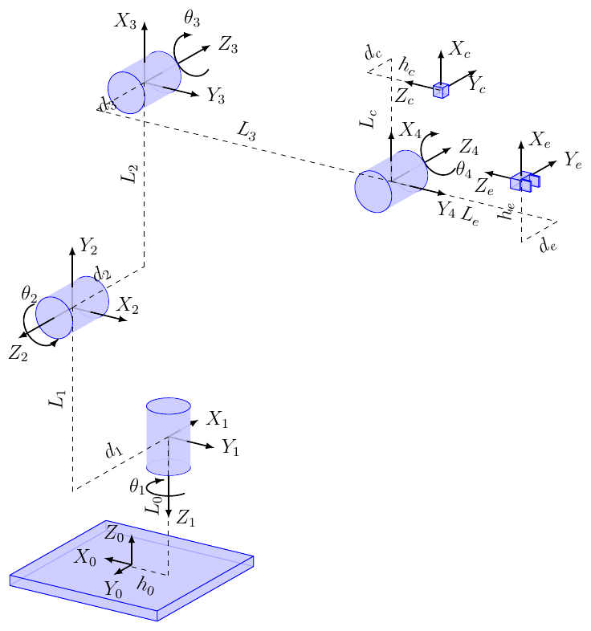
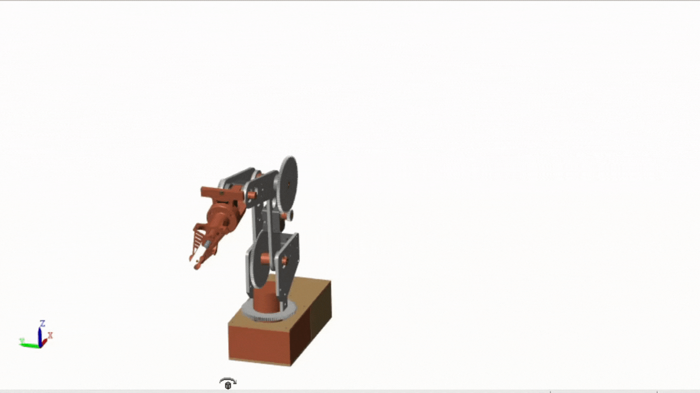

# eden_robotics_ros

Contains all the ros package for eden robotic project

Useful files are in this repository : [Eden Robotitcs Repos](https://github.com/AlessandriniAntoine/Eden_Robotics.git) (ros branch)

<figure>
    
    <figcaption>Figure 1 : Rviz Display for trajectory given by Xbox controller</figcaption>
</figure>

<figure>
    
    <figcaption>Figure 2 : Kinematic schema</figcaption>
</figure>

## Packages

- arm : forward kinematics, change point frame ,gazebo,rviz and controller node
- motors : package for dynamixel motors
- camera : package for vision (display camera and tracking)
- joy : joystick from ros [(link to repo)](https://github.com/ros-drivers/joystick_drivers.git)
- inverse kinematics : package build from Matlab document for inverse kinematics

## Installation

First source Ros and create workspace

```console
~ $ source /opt/ros/noetic/setup.bash
~ $ mkdir -p arm_ws && cd arm_ws
~/arm_ws $ catkin_make
```

Then clone repository in the src folder and build packages*

```console
~/arm_ws/src $ git clone https://github.com/AlessandriniAntoine/eden_robotics_ros.git
~/arm_ws/src $ cd .. && catkin_make
```

## Launch

Do not forget to source ROS and your package

```console
~/arm_ws $ source /opt/ros/noetic/setup.bash && source devel/setup.zsh
```

Launch the following launch files :

- rviz visualisation of the arm

```console
~/arm_ws $ roslaunch arm arm_rviz.launch
```

- Inverse kinematics (point directly in robot frame)
  
```console
~/arm_ws $ roslaunch arm inverse_kinematics.launch
```

- OpenLoop inverse kinematics in camera frame with rviz simulation :

```console
~/arm_ws $ roslaunch arm eden_openloop.launch
```

<figure>
    
    <figcaption>Figure 3 : Rqt plot on y axis for open loop</figcaption>
</figure>

You can also display the robot using the robot simulink file (see Eden_Robotics repo)

<figure>
    
    <figcaption>Figure 4 : Matlab display</figcaption>
</figure>

## Joystick Control

In this project we used a Xbox controller. You can controle the robot with the following button :

- A : authorize movement
- B : forbid movement
- Y : return to position zero
- left joystick : Control X and Y axis movement (camera frame)
- right joystick : control z axis movement (camera frame)

## Software

A requirement.txt file is present to install all python librairies.

- Python 3.8 : onshape-to-robot, openCV,modern robotic,
- ROS1 noetic
- Matlab 2022b
- Onshape

## Hardware

- Dynamixel motors (XL430, XC,XM)
- USB camera
- Controller (Xbox)
- Raspberry pi 3

## Useful links

- [Ros_documentation](http://wiki.ros.org/)
